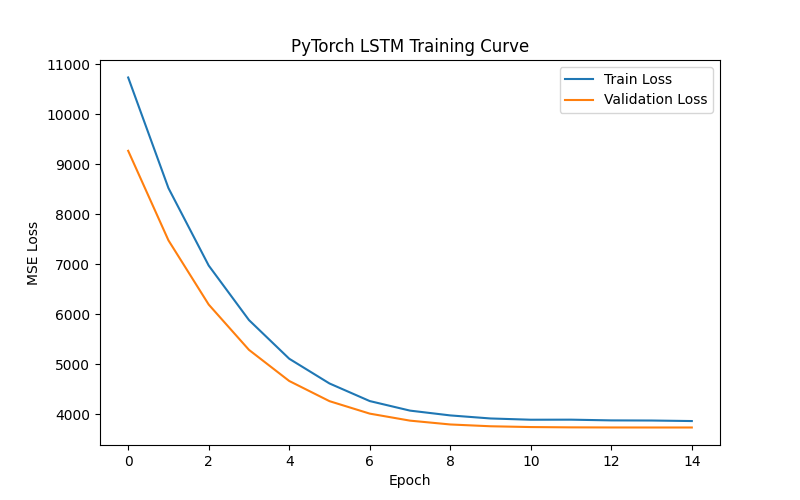
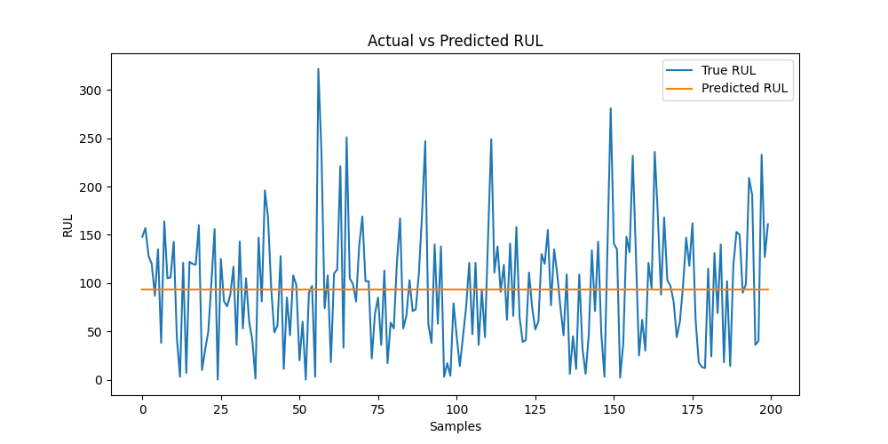

# Smart Predictive Maintenance using LSTM

## 🚀 Project Overview
This project builds a deep learning model to predict Remaining Useful Life (RUL) of aircraft engines using NASA CMAPSS dataset.

The goal is to predict when an engine will fail based on historical sensor readings.

---

## 📊 Dataset
- NASA CMAPSS (FD001 subset)
- 21 sensor features
- Time-series engine degradation data

---

## 🧠 Model Architecture
- LSTM (128 units)
- Dropout (0.3)
- LSTM (64 units)
- Dropout (0.3)
- Dense output layer
- Loss: Mean Squared Error (MSE)
- Optimizer: Adam

---

## 📈 Results

### Training Curve

### Prediction vs Actual

---

## 🛠 Tech Stack
- Python
- Pandas
- NumPy
- TensorFlow / Keras
- Matplotlib
- Scikit-learn

---

## 🎯 Outcome
Successfully built an end-to-end predictive maintenance deep learning system capable of estimating engine RUL from multivariate time-series sensor data.
